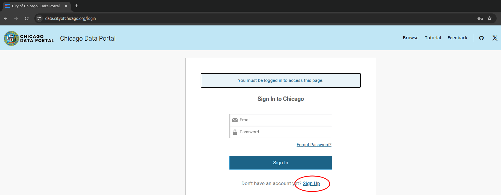
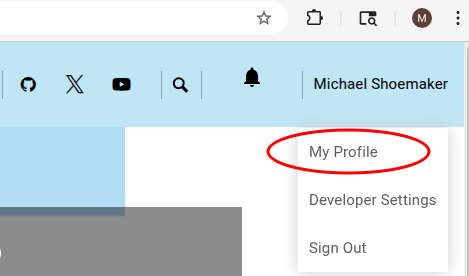
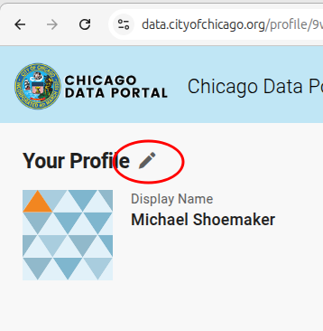
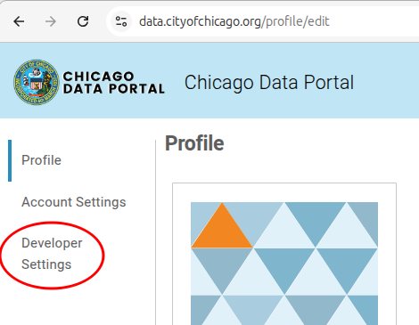
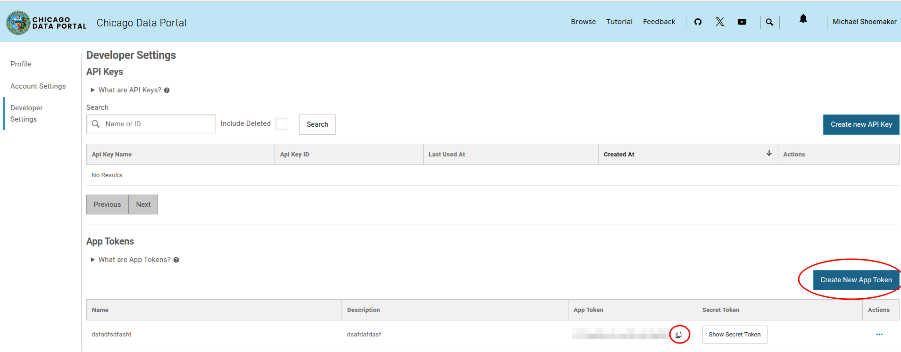

# How to Sign Up for the Chicago Data Portal and Create an API Token

This guide walks you through signing up for the [Chicago Data Portal](https://data.cityofchicago.org/) and creating an **App Token** for API access.

---

## 1. Sign Up for the Chicago Data Portal

1. Go to [https://data.cityofchicago.org/](https://data.cityofchicago.org/).
2. Click **"Sign In"** in the top-right corner and then **"Sign Up"** if you don't already have an account.
3. Fill out the registration form and you will receive an email with instructions to activate your account.



---

## 2. Access Your Profile

Once signed in:
1. Click your profile icon in the top-right corner.
2. Select **"My Profile"** from the dropdown menu.
3. Click the Pencil Icon shown next to your profile image. 



  

---

## 3. Go to Developer Settings

1. On your profile page, look for **Developer Settings**.
2. Click **"Create New App Token"**.



---

## 4. Create an App Token

1. Click **"Create App Token"**.
2. Enter a name and optional description.
3. Save your new token and copy it for later use.



---

## 5. Use the Token

You can now use your token when making API requests to the Chicago Data Portal, typically via a header like:

```bash
curl -H "X-App-Token: YOUR_TOKEN" "https://data.cityofchicago.org/resource/ijzp-q8t2.json"
